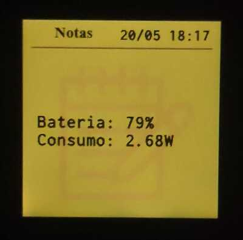

# open-minitela-R15M

Exemplo código-aberto de script simples para controlar a "mini tela" do notebook Positivo R15M no Linux (testado no Ubuntu 26.04).
- Dispensa necessidade de instalação, rodar continuamente ou rodar no início do sistema.
- Controle brilho da tela ou desligue-a.
- Escreva texto de até 100 caracteres ASCII ou monitore consumo de bateria.

## Exemplos de uso

1. **Desliga a mini tela:**
   
   `python3 ./minitela.py 0`

3. **Coloca a minitela com 100% de brilho e escreve mensagem:**
   
   `python3 ./minitela.py 100 "Hello world"`

4. **Coloca minitela em mínimo brilho e consulta informações sobre a bateria:**

   `python3 ./minitela.py 1`

6. **Coloca minitela em mínimo brilho e continuamente monitorar bateria em background a cada 5 segundos:**

   `nohup bash -c 'while true; do python3 ./minitela.py 1; sleep 5; done' > /dev/null 2>&1 &`

   

### Pré-requisitos
Certifique-se de ter o PySerial instalado:

`pip install pyserial`

ou

`sudo apt install python3-serial`

### Execução
Dê permissão de execução ao script:

`chmod +x minitela.py`
